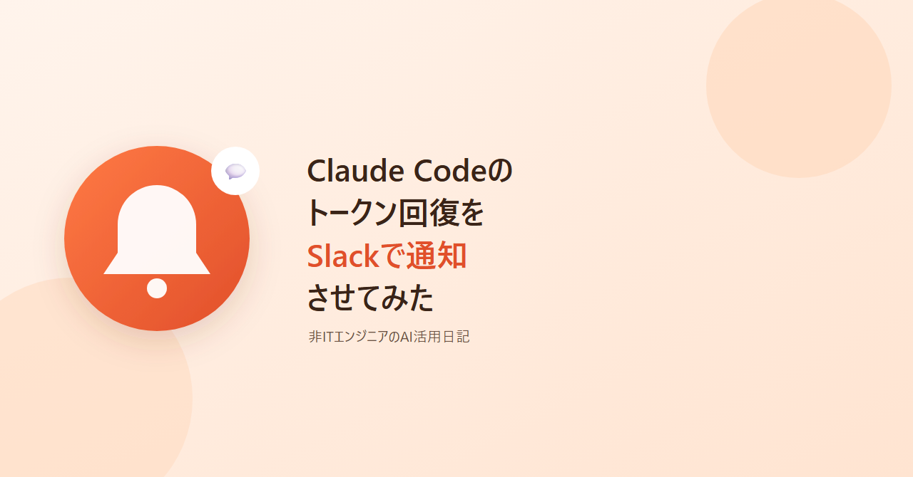
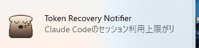
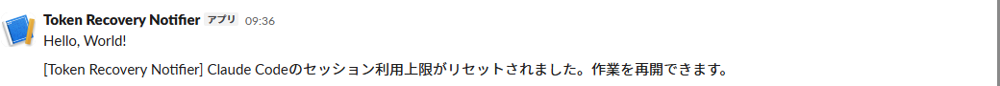
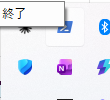
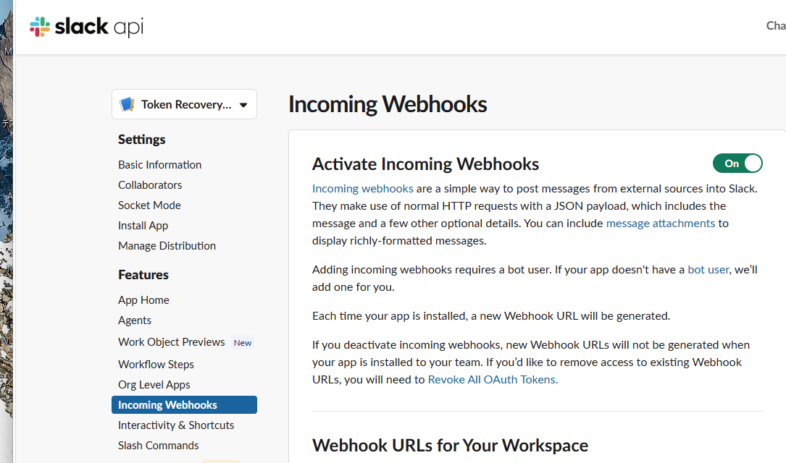
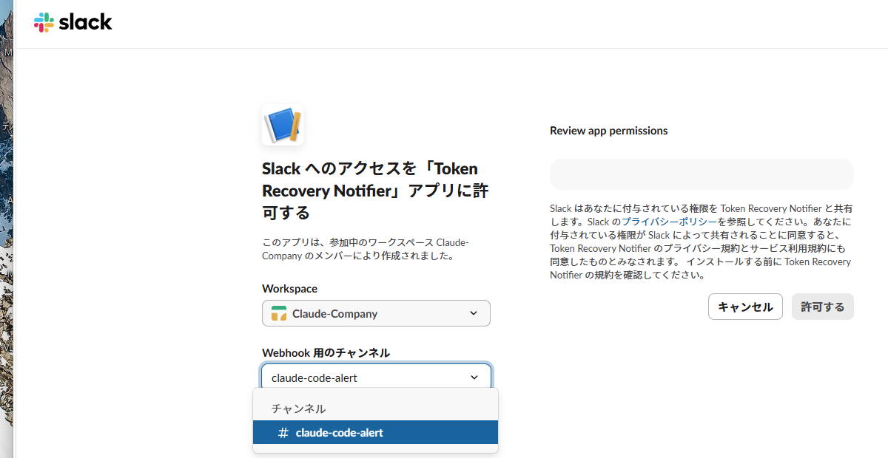
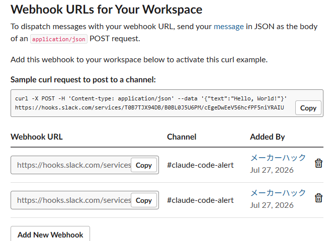

# Claude Codeのトークン回復をSlackで通知させてみた



こんにちは。エンジニアではない普通の会社員ですが、最近はClaude Codeに手伝ってもらいながら、自分用の小さなアプリをちょこちょこ作っています。

今回は「トークンを使い切って利用制限がかかったあと、トークンが回復してまた使えるようになったタイミングをSlackで教えてくれるアプリ」を作った話です。普段からClaude Codeを使っている方向けに、「レート制限、地味にストレスですよね」という共感と、その解決策としてAIエージェントと一緒に作ったアプリを紹介します。中身のコードの話は最小限にして、経緯や実際に起きたことを中心に書きました。

## 困っていたこと：使えるようになったのに気づかない

Claude Codeには利用できる量に上限があり、使いすぎると「しばらく使えません」という状態になります。一定時間経つとまた使えるようになる仕組みですが、問題は「また使えるようになったタイミング」を教えてくれる仕組みがないことでした。

- 上限に達すると、作業を中断せざるを得ない
- 「そろそろ復活してるかな」とターミナルを覗きに行く
- まだだったら二度手間、忘れていたら気づいた時には結構な時間が無駄に過ぎている

タイマーを自分でセットしたり、時々画面を確認しに行ったりするしかなく、地味にストレスでした。PCの前を離れているときは尚更で、気づいたら「あれ、もう1時間前に復活してたじゃん」ということもよくありました。

## 対策：まずはWindowsの通知、そしてSlackにも

そこで、「上限が解除されたタイミングを検知して、Windowsの通知（画面右下にポップアップするお知らせ）を出す」という常駐アプリを、以前AIエージェントと一緒に作っていました。



※実際にアプリから届いた通知をそのままキャプチャしたものです。

これだけでも便利だったのですが、PCの前にいないと気づけないという弱点がありました。なので今回は、このアプリに「Slackにも同時に通知を送る」機能を追加しました。Slackならスマホにも通知が届くので、PCから離れていても、外出中でも「あ、また使えるようになった」とすぐわかるようになります。



※こちらも実際にSlackへ届いたメッセージをそのままキャプチャしたものです。

やり方はシンプルで、Slackの「Incoming Webhook」という、決まったURLに投げるだけで特定チャンネルにメッセージを送れる仕組みを使いました。自分の設定ファイルにそのURLを1行書いておくだけで、以降はWindowsの通知とSlackの通知が両方届くようになります。設定しなければ今まで通りWindowsの通知だけが動くので、無理に設定する必要もありません（具体的な設定手順は、後述の「使ってみたい方向けのインストール手順」で詳しく説明します）。

## そもそも、このアプリはどうやって「復活のタイミング」を知るのか

ここで少し、このアプリの中身の話をさせてください。「Slackに通知を送る」だけならまだ想像がつくと思うのですが、そもそも「今まさに上限に達した」ことや「いつ復活するか」を、このアプリはどうやって知るのでしょうか。実はここが、このアプリの一番おもしろい部分です。

Claude Codeを使ったことがある方はご存知かもしれませんが、Claude Code CLIは自分とのやり取りの記録を、実は自分のパソコンの中に自動でファイルとして保存しています。普段は誰も見ることのない、いわば「裏の作業ログ」のようなものです。

今回、AIエージェントと一緒にこのアプリの仕組みを検討していたとき、「そのログファイルの中身を実際に覗いてみよう」ということになりました。すると、上限に達した瞬間の記録の中に、「いつ復活するか」という情報がそのまま書き込まれていることがわかったのです。実際に自分のパソコンに残っていた過去2〜3週間分・複数のプロジェクトのログを確認したところ、「◯時に復活します」という内容の記録が20件以上見つかりました。

つまりこのアプリは、特別な魔法を使っているわけではなく、

1. Claude Codeが裏側で自動的に保存しているログファイルを、定期的にこっそりチェックする
2. その中に「いつ復活するか」が書かれた記録が見つかったら、その時刻を覚えておく
3. 覚えておいた時刻になったら、Windowsの通知とSlackの通知を出す

という、地味だけど確実な仕組みで動いています。追加のログインや、どこか外部のサービスに接続する必要は一切なく、すべて自分のパソコンの中だけで完結しているので、その点は個人的に安心して使えるポイントだと思っています。

ちなみにこのログファイルの形式は、Claude Code側が公式に「ずっとこの形式のままです」と約束しているものではありません。今後のアップデートで記録のされ方が変わる可能性はゼロではなく、そうなった場合はこのアプリ側の対応も必要になるかもしれない、という点は正直に書き添えておきます（今回の調査では、確認できた範囲のバージョンで記録のパターンは一貫していました）。

## 使ってみたい方向けのインストール手順

「実際に使ってみたい」という方向けに、インストール方法を簡単に紹介します。Windows専用のアプリです。

一番手軽なのは、Node.jsのインストールが不要な「ポータブル版」です。

1. GitHubのReleasesからポータブルzip（`token-recovery-notifier-portable-win-x64-vX.Y.Z.zip`）をダウンロードし、任意のフォルダに展開します。
2. 展開したフォルダの中にある `TokenRecoveryNotifier.cmd` をダブルクリックして起動します。

   ※ポータブル版でも、実行にはNode.js 20系以降がPCにインストール済みであることが前提です（[nodejs.org](https://nodejs.org/)から入れられます）。

ソースから動かしたい方は、以下の手順でも起動できます。

```powershell
git clone <このリポジトリのURL>
cd token-recovery-notifier
npm install
npm run build
npm start
```

起動するとタスクトレイにアイコンが表示され、Windows起動時にも自動的に立ち上がるようになります。終了したいときは、タスクトレイアイコンを右クリックしてメニューから「終了」を選ぶだけです。



※こちらも実際の画面をキャプチャしたものです。ちなみにアイコン自体はまだ既定のPowerShellアイコンのままで、専用アイコンは今後の改善候補です。

### Slack通知を設定する（任意）

Slackにも通知を届けたい場合は、以下の流れで設定できます。プログラミングの知識がなくても、画面の指示に沿ってクリックしていけば大丈夫な作業です。

1. ブラウザで [api.slack.com/apps](https://api.slack.com/apps) を開き、「Create New App」→「Blank app」（空のアプリから始める、という意味です）を選びます。アプリの名前（何でも構いません、例えば「Token Recovery Notifier」など）と、通知を送りたいSlackワークスペースを選んで作成します。
2. 作成したアプリの管理画面が開いたら、左側のメニューから「Incoming Webhooks」を選び、右上のスイッチをONにして機能を有効化します。



3. 画面を下にスクロールすると出てくる「Add New Webhook」というボタンを押します。
4. 「Slackへのアクセスを許可する」という画面に切り替わるので、「Webhook用のチャンネル」で通知を送りたいチャンネル（例えば自分専用の通知チャンネルなど）を選び、「許可する」をクリックします。



5. 元の画面に戻ると、発行された `https://hooks.slack.com/services/…` という形のURL（Webhook URL）が表に表示されるので、これをコピーします。



6. パソコンの `%USERPROFILE%\.token-recovery-notifier\config.json` というファイルを（なければ新規作成して）開き、以下のようにコピーしたURLを貼り付けて保存します。

```json
{
  "slackWebhookUrl": "https://hooks.slack.com/services/xxxxx/xxxxx/xxxxxxxxxxxxxxxxxxxxxxxx"
}
```

7. アプリを再起動すれば設定完了です。以降、レート制限が復活したタイミングでWindowsの通知とSlackの通知が両方届くようになります。

実際にこの手順で設定して送信テストしたところ、Slackのチャンネルに「Claude Codeのセッション利用上限がリセットされました。作業を再開できます。」という通知がきちんと届くことを確認済みです。

この設定をしなければ、これまで通りWindowsの通知だけが届く動作になるので、気になった方だけ試してもらえればと思います。

## 完成したコード

というわけで完成したものをGitHubに公開しました。Windowsで動く常駐アプリで、無料で使えます。よかったら使ってみてください。

https://github.com/makeraihack/token-recovery-notifier

## 最後に

ここまで読んでいただきありがとうございました。「便利だな」「面白かったな」と思っていただけたら、この記事の下に表示されている「気に入ったらサポート」ボタンから、応援していただけると嬉しいです。無理のない範囲で構いません。次のアプリ作りの励みになります。
